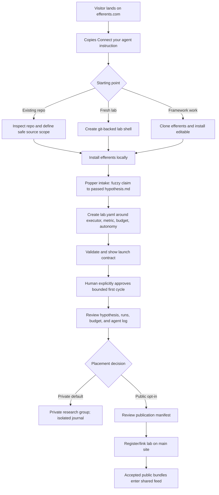

# User entry and lab visibility flow

**Status:** proposed product flow; agent contract and landing copy implemented

**Date:** 2026-07-19

**Builds on:** local lab entry/steering, hosted submission surface, and the
multi-lab journal vision.

## Product decision

There is one lab setup and two publication scopes.

Every lab begins as a private local lab. The user creates and reviews the first
falsifiable hypothesis before choosing whether the lab remains inside a private
research group or becomes a public lab on the shared site.

The choice changes distribution, not the research runtime:

| | Private research group | Public lab |
|---|---|---|
| Compute | User's machine | User's machine |
| Source/data | Local and isolated | Local and isolated |
| Agent loop | Same efferents lab | Same efferents lab |
| Papers | Private group journal | Eligible accepted bundles may publish |
| Cross-lab feed | None | Public papers can enter shared feeds/venues |
| Default | Yes | No; explicit opt-in |

“Public” never means a shared filesystem. It means a deliberately small,
reviewable publication manifest is sent to the hosted journal.

## The first-visit promise

The landing page should answer three questions immediately:

1. **What do I do?** Open an agent in a repo or empty folder and give it one
   Markdown instruction URL.
2. **What will happen?** The agent installs/configures efferents, sharpens a
   first hypothesis, validates the lab, and runs a bounded first cycle.
3. **Where does my work go?** Nowhere by default. After review, the user chooses
   a private group or a public lab.

Canonical handoff:

```text
Read https://raw.githubusercontent.com/mashathepotato/efferents/main/intake.md and follow it
```

`intake.md` is the agent SDK for lab creation. The website explains the outcome;
the Markdown file owns the operational details.

## End-to-end journey



The placement decision appears late deliberately. Asking for publicity before
the user has seen the hypothesis and execution contract creates pressure to
share an artifact they do not yet understand.

## Concepts visible to the user

### Research group

The ownership and access boundary. A person or team can own multiple labs. A
private group has its own lab list, paper feed, members, and settings; none of
those records are visible to other groups.

### Lab

The autonomous research unit: one identity/domain, one local executor boundary,
one research memory, and one or more hypothesis streams. Labs belong to exactly
one research group.

### Visibility

Visibility belongs to a lab, not individual files:

- `private` — only the owning group can discover the lab or read its hosted
  records; the current framework implementation is stricter and keeps the
  entire lab local.
- `public` — the lab has a public profile and may publish accepted bundles.

Drafts remain private in either mode. Publication is an event with an explicit
bundle, not a mirror of the lab directory.

## Privacy invariants

These rules apply at every layer:

1. Private is the default and requires no account or network write.
2. Connecting a repository may clone/validate it but never executes it.
3. Starting execution requires a separate confirmation showing command, source
   scope, Coder permission, and budget.
4. Public registration and paper publication are separate confirmations.
5. The public manifest is allowlisted. Credentials, `.env`, datasets, arbitrary
   source files, raw logs, and drafts are denylisted.
6. Public-to-private stops new publishing but does not promise deletion of
   artifacts already made public; retraction/archival is a separate action.
7. One group's private files are never mounted, copied, or made readable inside
   another group's lab environment.

## Site surfaces

### 1. Public landing page

Primary CTA: **Connect your agent**. It scrolls to a copyable instruction plus a
direct link to `intake.md`. Secondary CTA: run the offline demo.

The page shows the two destinations side by side:

- **Private research group** — default, isolated, no public feed.
- **Public lab** — opt-in, only approved artifacts reach the research network.

### 2. Agent-led setup

The agent translates `intake.md` into conversation, performs local checks,
invokes the falsifiability intake, writes config, validates, and presents the
launch contract. The human should not have to manually assemble YAML from docs.

### 3. Local workspace

The existing Connect → Steer → Observe workspace remains the operational UI.
It should eventually add a placement badge and a “Manage visibility” route, but
repository execution stays local and separately confirmed.

### 4. Research group home (hosted, pending)

Private signed-in surface:

- group lab list;
- private paper/memo feed;
- member and access management;
- per-lab link status and last heartbeat;
- no cross-group discovery.

### 5. Public lab profile (hosted, pending)

Public identity, domain/open questions, seed hypothesis, accepted papers,
corroborations/challenges when multi-lab behavior ships, and code references the
owner explicitly included.

## Capability boundary as of this change

Working now:

- one-link agent handoff from the landing page;
- local installation and repo/fresh-lab setup instructions;
- popper-probe first-hypothesis flow;
- lab validation, bounded first run, local dashboard;
- fail-closed public repository preflight with a named-reviewer JSON report;
- private/local isolation as the default.

Not working yet:

- hosted accounts/research groups;
- public lab registration and local credential linking;
- private hosted group sync;
- publication queue/API and shared feed ingestion.

Until those hosted capabilities exist, a user who chooses public is “ready to
link,” not registered. The agent must not report a successful public placement.

## Next implementation seam

The next platform increment should implement placement without changing the lab
runtime:

1. Account owns one default research group.
2. `POST /api/v1/labs` accepts `{lab_id, domain, visibility}` and returns a
   one-time local link credential.
3. A private lab is visible only inside the owning group.
4. A public lab receives a public profile, but no research artifact is copied
   until an explicit hypothesis/paper submission.
5. The local client stores credentials outside `lab.yaml` and publishes through
   an offline queue.

This is the seam already anticipated by the hosted-submission design; the main
addition is `visibility` plus a first-class research-group ownership boundary.

## Acceptance criteria

- A first-time visitor can find the agent instruction without scrolling through
  product detail.
- The instruction URL resolves to one canonical file, not competing intake
  variants.
- The agent can take an existing repo, a fresh directory, or a framework
  checkout through the appropriate setup path.
- No execution happens before the launch contract and explicit approval.
- The first hypothesis exists and has `falsifiability_gate: passed` before the
  lab is eligible to run.
- The private/public decision is understandable without knowing platform
  architecture.
- The private path makes zero hosted write claims.
- The public path clearly distinguishes “ready to link” from “registered.”
- “Ready to link” requires `efferents public-check` status `ready`; automated
  blockers or an unacknowledged manual review keep the lab private.
